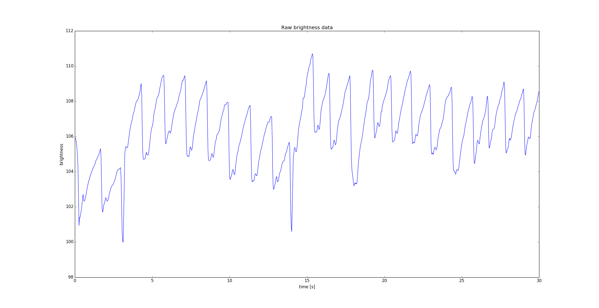
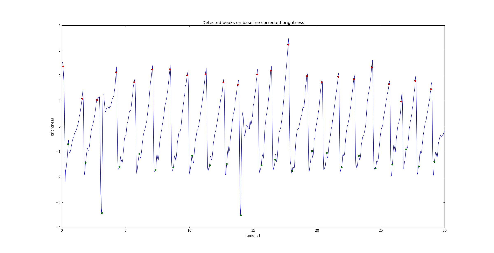

# Pulse - proof of concept
Calculate heart rate from mp4 video of thumb taken from a smartphone

## Method
1. Calculate **brightness** on each frame *(mean value over each pixel and RGB channel)*
2. Remove baseline fluctuations using the [Asymmetric Least Squares Smoothing](https://zanran_storage.s3.amazonaws.com/www.science.uva.nl/ContentPages/443199618.pdf)

### FFT method
  * calculate FFT of signal
  * find frequency corresponding to maximum FFT coefficient

Heart beats per minute is given by maximum FFT frequency * 60
  
### Spike detector
   * count positive amplitude spikes *(and calculate spike occurence [spikes/minute])*
   * count negateive amplitude spikes *(and calculate spike occurence [spikes/minute])*

Heart beats per minute is given by the average of the positive and negative spike occurence

## Video
Acquired using a Nexus 4 (Ubuntu Touch OS) with the flash LED **on**. The current script expects a `.mp4` file **without a soundtrack**
*(bitrate of the video was reduced so it could be uploaded on the web)*.

## Dependencies
* [imageio](https://github.com/imageio/imageio): `.mp4` processing
* scipy
* numpy
* matplotlib

